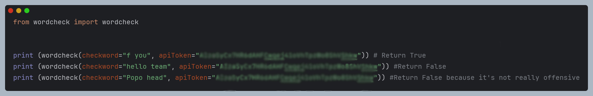

# Clean W0rd
### An AI-powered word filter that detects and censors offensive language, even when creatively altered, to ensure clean and respectful communication.


## API keys

To run this project, you will need to add FREE api service

- Gemini API At [Ai Studio](https://aistudio.google.com/apikey)
Replace `apiToken` With your API key


## Installation

Install CleanWord with Git


```bash
  git clone https://github.com/LuterCat1/CleanW0rd.git
  cd CleanW0rd

```
    
## Usage/Examples

```python
from wordcheck import wordcheck

print(wordcheck(checkword="The Word you wanna Check" , apiToken="Your Gemini API Token"))
```

